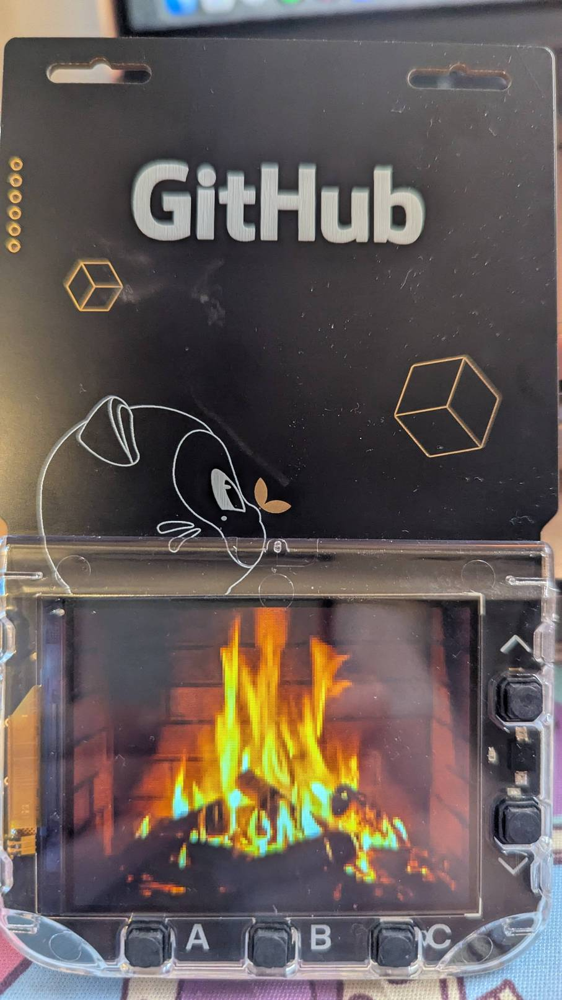

# 🔥 Fireplace

A cosy animated fireplace app for the GitHub Universe 2025 badge. The speed can be adjusted to the user's preference.



This app was inspired by the fireplace from [Lenny's Podcast](https://www.lennysnewsletter.com/podcast) quietly running in the background.


## Controls

| Button | Action |
|--------|--------|
| **↑ UP** | Speed up (−50ms per press, min 50ms/frame) |
| **↓ DOWN** | Slow down (+50ms per press, max 1000ms/frame) |
| **A / B / C** | Reset to default speed |
| **HOME** | Return to menu |

The current frame duration is displayed briefly at the bottom of the screen whenever the speed is changed.

## Installation

Copy the `fireplace/` folder to `/system/apps/fireplace/` on your badge (put it into disk mode first by double-pressing RESET while connected via USB-C).

```
fireplace/
├── __init__.py       # App code
├── icon.png          # Menu icon (24x24)
├── assets/           # Source images
│   ├── fireplace.gif         # Original source GIF
│   ├── fireplace_badge.jpg   # Badge photo
│   └── lenny_fireplace.jpg   # Lenny photo
└── frames/           # Extracted PNG frames (frame_0000.png … frame_0019.png)
```

## Running in the Simulator

```bash
python simulator/badge_simulator.py badge/apps/fireplace -C badge --scale 4
```

## Animation Details

- **Source**: [Tenor GIF](https://tenor.com/en-CA/view/seninle-a%C5%9Fkom-yalanmo%C5%9F-gif-27389050)
- **Frames**: 20 PNGs at 160×120 pixels
- **Default speed**: 100ms per frame (10 fps)
