# `PixelFont` - load

This class provides functions for loading pixel fonts, which can then be used to render text onto images.

Text is drawn using the currently selected brush, allowing for alpha blending and other visual effects.

PicoGraphics includes thirty high-quality, licensed pixel fonts created by [somepx](https://somepx.itch.io), giving you plenty of options to add style and character to your applications.

```python
# example of how to draw text onto the screen

import math
from badgeware import screen, PixelFont

screen.font = PixelFont.load("nope.ppf")

def update():
  screen.brush = brushes.color(20, 40, 60)
  screen.clear()

  # draw the message at random locations with alpha blending
  screen.brush(0, 255, 0, 100)
  for i in range(10):
    x = math.randint(0, 160)
    y = math.randint(0, 120)

    screen.text("badgeware!", x, y)
```

## Measuring text

When outputting text you often want to align it or word wrap it. This requires the ability to measure a piece of text so that you can adjust its position before drawing it to the screen.

```python
# example of centering text using the measure_text method

from badgeware import screen, PixelFont

screen.font = PixelFont.load("nope.ppf")

def update():
  screen.brush = brushes.color(20, 40, 60)
  screen.clear()

  # center the text on screen
  message = "this is my message"
  w, h = screen.measure_text(message)
  screen.brush(0, 255, 0)
  screen.text(message, 80 - (w / 2), 60 - (h / 2))
```

## Static methods

`PixelFont.load(path)`\
Creates and returns a new `PixelFont` object representing the specified font.

## Properties

`height`\
The height, in pixels, of the fonts glyph bounding box.

`name`\
The name of the pixel font.

## Included fonts

**absolute**: bold, boxy, 10px tall\


**ark**: tiny, smallcaps, 6px tall\
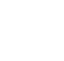

**awesome**: cheerful, wholesome, monospace, 9px tall\


**bacteria**: rational, wide, monospace, 12px tall\
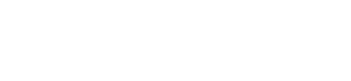

**compass**: classic, fantasy, 9px tall\
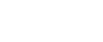

**corset**: elegant, cozy, 8px tall\
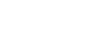

**curse**: comic, horror, smallcaps, 12px tall\


**desert**: tiny, drowsy, sunny, 6px tall\
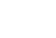

**fear**: smallcaps, horror, 11px tall\
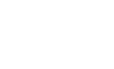

**futile**: big, bold, unique, 14px tall\


**holotype**: distinctive, premium, 9px tall\
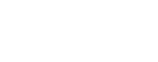

**hungry**: playful, unique, monospace, 7px tall\


**ignore**: colossal, super-readable, intrepid, 17px tall\
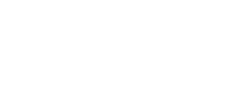

**kobold**: classic, tiny, fantasy, 7px tall\
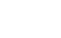

**lookout**: adventurous, piratesque, fantasy, 7px tall\
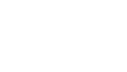

**loser**: slanted, smallcaps, monospace, 7px tall\
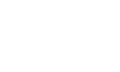

**manticore**: strong, metal, horror, 14px tall\


**match**: classic, joyful, 7px tall\


**memo**: wacky, distinctive, 9px tall\


**more**: chunky, huge, comic, 15px tall\


**nope**: clear, readable, 8px tall\
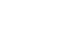

**outflank**: fantasy, arcane, 9px tall\
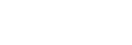

**saga**: medieval, fantasy, legendary, 8px tall\
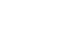

**salty**: thick, all-purpose, 9px tall\


**sins**: tiny, classic, stylish, 7px tall\
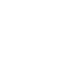

**smart**: classic, chunky, smallcaps, 9px tall\


**teatime**: classic, readable, monospace, 7px tall\


**torch**: fiery, pocket-sized, fantasy, 6px tall\


**troll**: fantasy, ornate, 12px tall\
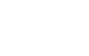

**unfair**: wide, retro, eccentric, 8px tall\


**vest**: elegant, classic, serif, 9px tall\


**winds**: tiny, extra-spaced, easy to read, 7px tall\
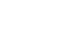

**yesterday**: bold, readable, distinctive, 10px tall\


**yolk**: classic, fantasy, 9px tall\
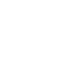

**ziplock**: round, cheerful, comic, 13px tall\


> todo: include font sampler image